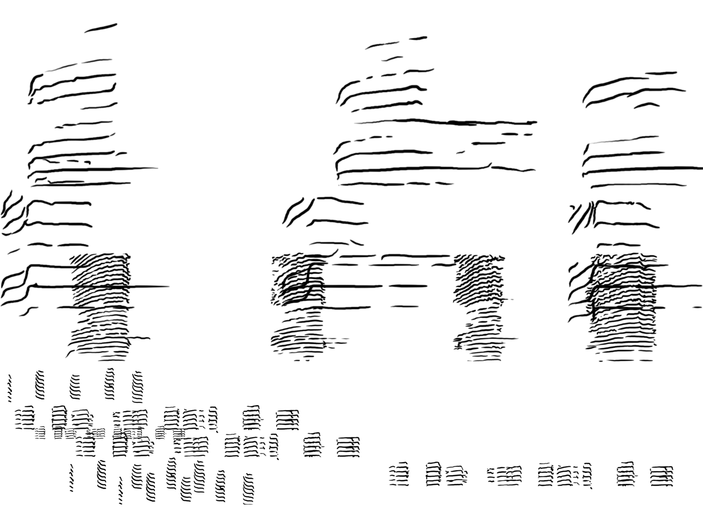
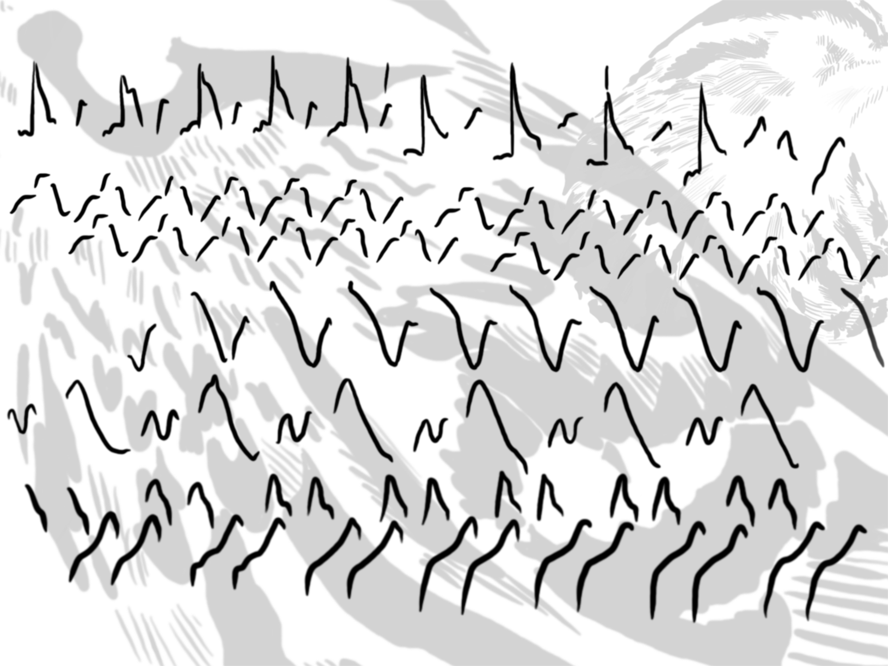
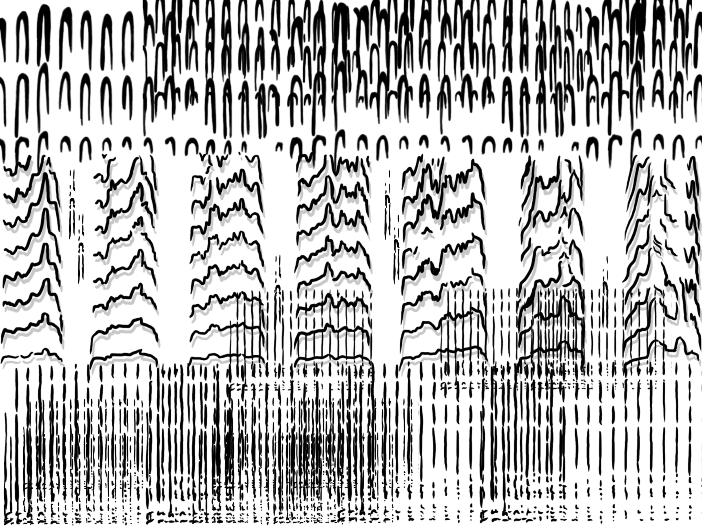
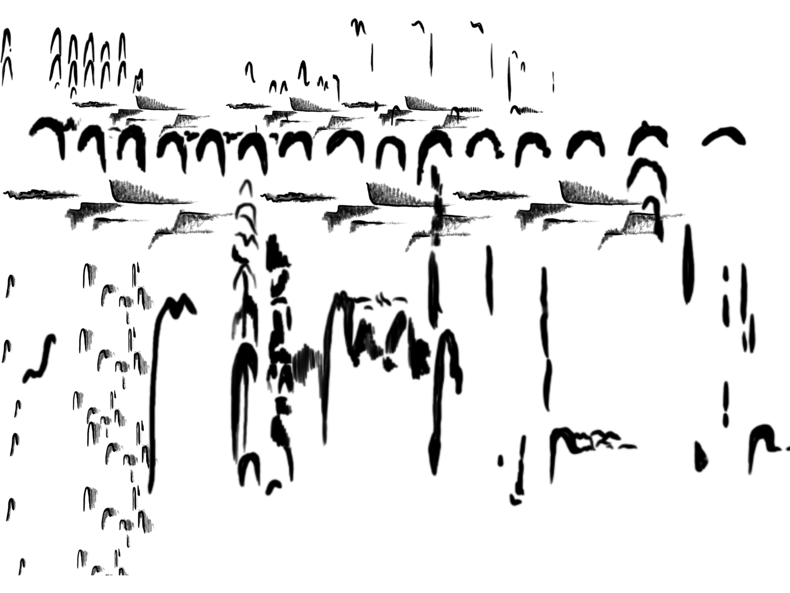

It surprises me that making art with birdsong spectrograms isn't more common; they're so distinctive and pretty. These pieces were made in Procreate on iPad. Spectrograms are not to scale; I've used them as stamps to create larger art pieces.

{width=80% fig-align="left" fig-alt="Black and white artwork composed of shapes derived from bird call spectrograms for Clark's nutcracker and red-breasted nuthatch."}

{width=80% fig-align="left" fig-alt="Black and white artwork composed of shapes derived from bird call spectrograms for black-and-white warbler."}

{width=80% fig-align="left" fig-alt="Black and white artwork composed of shapes derived from bird call spectrograms for downy woodpecker, northern flicker, and hairy woodpecker."}

{width=80% fig-align="left" fig-alt="Black and white artwork composed of shapes derived from bird call spectrograms for Clark's nutcracker and mountain chickadee."}