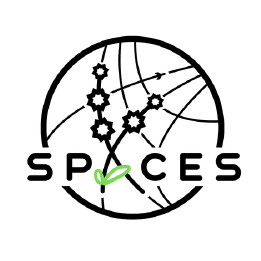
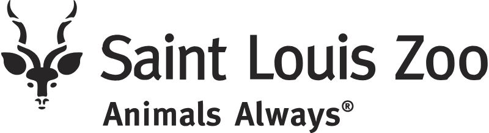

## Working with me

Building data science skill capacity for research teams is some of the most rewarding work that I do. I am particularly knowledgeable about open science and reproducible workflows, data and project management for research teams, version control, and data wrangling. I combine extensive research experience in ecology with 10+ years of data science experience and training in evidence-based pedagogy to bridge the gap between technical skills and the practical needs of research teams. 

**_To discuss potential projects and rates, email me at kaija.gahm@gmail.com._**

## Certifications and training

I've sought out a variety of opportunities to study and practice evidence-based pedagogy. I believe in inclusive teaching that takes into account motivation and cognitive load to move learners from fear to self-efficacy in coding and data science.

#### The Carpentries
  
  - [Collaborative Lesson Development Training](https://carpentries.org/lesson-development/) (2024)
    - _Curriculum in development: "[RRRRR, I'm stuck! Minimal reproducible examples in R](https://github.com/carpentries-incubator/R-help-reprexes)"_
  - [Instructor Trainer Certification](https://carpentries.org/community/instructor-trainers/) (2024)
  - [Instructor Certification](https://carpentries.org/community/instructors/) (2021)

## Past consulting and training work

I'm helping the SPACES Institute set up their workflow and project organization as they study biodiversity using remote sensing data (2026).

I taught [Data Analysis and Visualization in R for Ecologists](https://datacarpentry.github.io/R-ecology-lesson/) for the team at the St. Louis Zoo (2023).